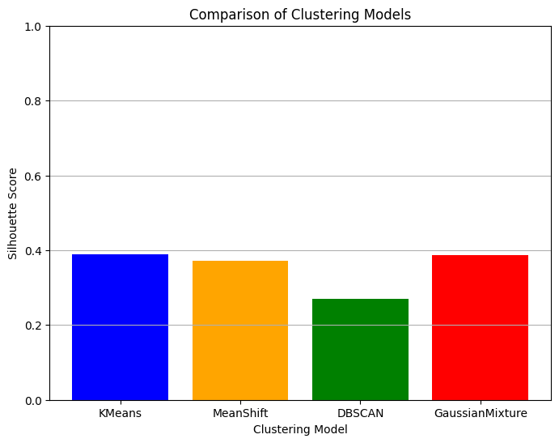

# Home Page

## Project Overview and Objectives
Banks face challenges in targeting marketing effectively due to limited personalization, resulting in low engagement and inefficient use of resources. This project seeks to develop an AI-driven system using machine learning to personalize marketing campaigns, aiming to improve engagement, conversion rates, and support data-driven marketing strategies.

## Team Members
- **Data Scientists (Group A)**: Develop machine learning models and perform data analysis.
- **Data Scientists (Group B)**: Develop machine learning models and perform data analysis.

## Quick Links to Key Sections
- [Business Understanding](#business-understanding)
- [Company Analysis](#company-analysis)
- [Industry Analysis](#industry-analysis)
- [Competitive Landscape](#competitive-landscape)
- [Data Understanding](#data-understanding)
- [Data Preparation](#data-preparation)
- [Modeling](#modeling)
- [Evaluation](#evaluation)
- [Deployment](#deployment)
- [Technical Implementation](#technical-implementation)
- [Analytical Findings](#analytical-findings)
- [Recommendations](#recommendations)
- [Future Work](#future-work)
- [Lessons Learned](#lessons-learned)
- [References](#references)
- [Appendices](#appendices)

---

# Business Understanding

## Detailed Description of the Business Problem
The project addresses the lack of personalization in bank marketing campaigns, which leads to low engagement and inefficient resource use. Traditional methods fail to leverage data effectively to meet individual customer needs.

## Key Stakeholders and Their Needs
- **Marketing Team**: Requires tools for creating effective, personalized campaigns.
- **Bank Executives**: Seek better marketing ROI and enhanced customer satisfaction.
- **IT Team**: Needs secure, reliable data systems.
- **Customers**: Prefer relevant marketing that meets their interests and needs.

## Success Criteria for the Project
- **Increased Engagement**: Higher engagement in personalized marketing campaigns.
- **Higher Conversion Rates**: More conversions from targeted campaigns.
- **Data-Driven Decisions**: Marketing strategies informed by model insights.
- **Resource Efficiency**: Cost-effective campaigns due to targeted personalization.

---

# Company Analysis

## History and Background
The Portuguese bank involved in this project is a leading institution in retail banking, known for prioritizing customer-centric service across Portugal. Its traditional marketing strategy includes using direct marketing campaigns to promote term deposits through personalized customer interactions (Rathi, 2020).

## Mission, Vision, and Core Values
The bank's mission centers around providing secure and reliable banking solutions while fostering financial empowerment. Its values emphasize transparency, integrity, and a commitment to excellent customer service, which helps build long-term customer relationships and financial well-being (Rathi, 2020).

## SWOT Analysis
- **Strengths**: Strong brand recognition, extensive customer data, and a skilled marketing team.
- **Weaknesses**: Limited effectiveness of some marketing efforts, heavy reliance on phone-based marketing, and privacy concerns.
- **Opportunities**: Expanding digital channels, leveraging machine learning for insights, and reaching new demographics.
- **Threats**: Regulatory restrictions on data use, rising competition from digital-first banks, and market saturation (Tariq, 2022).

## Strategy Alignment with Goals
The bank's strategy of direct phone-based marketing aims to increase term deposits by facilitating personal, targeted communication. Integrating AI-driven customer segmentation aligns with its goal of enhancing engagement and campaign effectiveness (Silva & Santos, 2021).

## Market Position and Competitive Advantage
As a leading bank in Portugal, this institution leverages its extensive customer base and local insights. This established reputation offers a competitive advantage over newer, digital-only entrants (Rathi, 2020; Tariq, 2022).

---

# Industry Analysis

## Key Trends and Developments
The Portuguese banking sector is rapidly digitalizing, with a push toward AI-driven solutions to enhance customer engagement and marketing efficiency. Phone-based campaigns remain common but face limitations in reach and cost-effectiveness, making data-driven methods essential (Silva & Santos, 2021; Tariq, 2022).

## Main Competitors
The bank’s main competitors include both national and international banks with digital-first offerings that appeal to tech-savvy consumers, presenting a competitive challenge (Tariq, 2022).

## SWOT Analysis
- **Strengths**: Strong customer trust, regulatory experience, and comprehensive service offerings.
- **Weaknesses**: Limited digital outreach and slow adaptation to modern technology.
- **Opportunities**: Integrating AI into marketing, partnering with tech companies, and exploring new customer demographics.
- **Threats**: Growing fintech competition, stringent data regulations, and economic fluctuations (Silva & Santos, 2021).

## Regulatory and Legal Considerations
The bank must comply with GDPR and other regulations governing data usage and customer privacy in Portugal. These laws heavily influence the bank’s direct marketing practices, making transparency a key factor (Tariq, 2022).

## Economic Factors
Portugal's economic stability affects customer demand, with low-interest rates pushing banks to offer attractive deposit options. Economic drivers also shape the bank's focus on secure, long-term deposits to attract cautious investors (Rathi, 2020; Tariq, 2022).

---

# Competitive Landscape

## Direct and Indirect Competitors
Direct competitors include other Portuguese banks offering similar deposit options, while indirect competition comes from fintech companies with advanced digital offerings (Tariq, 2022).

## Competitor Strengths and Weaknesses
Competitors often excel in digital outreach but may lack the same customer loyalty and local knowledge, providing the bank with a unique advantage (Silva & Santos, 2021).

## Product Comparison
The bank’s deposit products are competitive in rates and terms but could be further differentiated through more personalized service and enhanced marketing outreach (Rathi, 2020).

## Competitor Strategies and Differentiation
Many competitors emphasize digital and AI-driven campaigns, which the bank aims to emulate to modernize its traditional phone-based strategy while retaining its focus on customer trust (Tariq, 2022).

---

# Data Understanding

## Data Sources and Collection Methods
- **Banking Dataset - Marketing Targets**: The main dataset containing bank customers' demographics and the bank products they consume. https://www.kaggle.com/datasets/prakharrathi25/banking-dataset-marketing-targets
- **Bank Personal Loan**: Complementary dataset for synthetic additional columns for other bank products. https://www.kaggle.com/datasets/mahnazarjmand/bank-personal-loan/data
- **Bank Customer Segmentation** Complementary dataset for synthetic additional columns for other customer engagement data. https://www.kaggle.com/datasets/shivamb/bank-customer-segmentation
- **Online Banking / Financial Review Dataset** Complementary dataset for customer comments analysis. https://www.kaggle.com/datasets/yanmaksi/reviews-data-for-classification-model?resource=download
- **Digital Marketing Dataset** Complementary dataset for ROI prediction of marketing strategies. https://www.kaggle.com/datasets/arpit2712/digital-marketing-company
- **Banking Customer Churn Prediction Dataset** Complementary dataset for Customer Churn prediction. https://www.kaggle.com/datasets/saurabhbadole/bank-customer-churn-prediction-dataset/versions/1/data 

## Initial Data Exploration Findings
- **Demographics**: Younger customers are more responsive to digital campaigns.
- **Transaction Patterns**: Specific transactions correlate with product preferences.
- **Engagement Trends**: Higher engagement correlates with higher conversion rates.

## Data Quality Assessment
- **Missing Data**: Some gaps in demographic and transaction data.
- **Data Consistency**: Formatting inconsistencies in engagement metrics.
- **Outliers**: Transaction and engagement outliers identified for review.

---

# Data Preparation

## Data Cleaning Processes
- Removal of duplicates, handling of missing values, and standardizing data formats.


### Synthetic Data Generation

To enhance our dataset, we generated synthetic data for two additional columns, supporting [goal, e.g., enhanced product prediction and segmentation]. This process involved training a machine learning model with overlapping columns from two datasets to predict and generate the missing product data in our current dataset.

#### Methodology Summary

1. **Identifying Overlapping Columns**:
   - Overlapping columns present in both the source dataset (which contained the target product data) and the current dataset were used as features for training a machine learning model to predict the missing product columns.

2. **Model Training and Prediction**:
   - Using [mention model type, e.g., Random Forest Regressor], we trained a model to predict the product columns based on overlapping features, thereby generating synthetic data aligned with real data distributions.

3. **Validation and Quality Check**:
   - Validation was conducted to ensure that the synthetic columns aligned well with existing data and maintained consistent distributions, reducing potential bias.

For full details, refer to **Appendix C: Synthetic Data Generation Notebook**.


## Feature Engineering

In this project, feature engineering was performed to enhance the dataset and prepare it for analysis and modeling. Key steps included renaming columns, transforming categorical variables, and creating new features. Below is a summary of the main feature engineering steps applied:

1. **Column Renaming**:
   - The target variable `y` was renamed to `term_deposit` to provide clarity, making it easier to interpret and reference in subsequent analysis.

2. **Categorical Encoding**:
   - Categorical columns such as `job`, `marital`, `education`, `month`, and others were identified and prepared for analysis.
   - Count plots were used for categorical variables to visualize the distribution, ensuring a better understanding of class imbalances or dominant categories.

3. **Product Segmentation**:
   - The dataset includes various products: `loan`, `term_deposit`, `cd_account`, and `securities`. These products were isolated to analyze individual customer engagement patterns and predict preferences for specific products.

4. **Feature Engineering for Temporal Variables**:
   - The `month` column was ordered and visualized to understand seasonality and monthly trends, which can help improve model performance by capturing temporal patterns.

5. **Numerical Feature Selection**:
   - Numerical columns were extracted for separate analysis and visualization, providing insights into features like `balance`, `day`, `duration`, `campaign`, and others. These variables were checked for outliers, skewness, and distributions.

### Example Code Snippet
In the notebook, the following code was used to process and visualize categorical and numerical columns:

```python
# Categorical feature identification
categorical_columns = list(data.select_dtypes(include=['object']).columns) + ["term_deposit", "cd_account", "securities"]

# Numerical feature extraction
numeric_columns = [_col for _col in data.columns if _col not in categorical_columns]

# Renaming target variable
data.rename({"y": "term_deposit"}, axis="columns", inplace=True)
```

## SQL Queries
- Examples of queries used for aggregating transaction data, joining tables, and filtering by recent activity.

## Final Dataset Structure
A cleaned, structured dataset with essential features for model training and analysis.

---

# Modeling

## Modeling Techniques Considered
- Logistic regression, decision trees, random forests, and gradient boosting.

## Model Selection Criteria
- Models were chosen based on interpretability, accuracy, computational efficiency, and their suitability for handling categorical and numerical data.

## Detailed Description of the Modeling Process

1. **Feature Selection**:
   - **Recursive Feature Elimination (RFE)** was used to identify the most relevant features for each product separately. This was necessary as some features had high dimensionality and could introduce noise into the model if not carefully selected.

2. **Data Preprocessing**:
   - **Categorical Encoding**: Label encoding was applied to categorical columns (`job`, `marital`, `education`, etc.), saving the encoders for consistency across model training and future predictions.
   - **Scaling**: Standard scaling was used for numerical features to normalize the data. This step helps ensure model stability and improve performance, particularly for models sensitive to feature scales.

3. **Correlation Analysis**:
   - **Correlation Check**: A correlation matrix was generated to assess relationships between product columns (`loan`, `term_deposit`, `cd_account`, and `securities`). Results showed low correlation, confirming the need to approach feature selection individually for each product model.

## Detailed Description of the Chosen Model(s)
- **Gradient Boosting Model**: Selected for its high accuracy in predicting conversion likelihood and ability to handle complex feature interactions effectively.
- **Random Forest**: Applied as an additional model, valued for interpretability and robustness against overfitting, especially when used with RFE-selected features.

## Model Performance Metrics and Interpretation
- **Precision**: Measures the model’s ability to correctly identify true positives, critical for evaluating marketing effectiveness.
- **Recall**: Indicates the model’s success in capturing all positives, which is essential for understanding campaign reach.
- **F1 Score**: Provides a balanced metric, combining precision and recall for comprehensive evaluation.
- **R² Score** (Random Forest and Gradient Boosting Models): Used to evaluate the overall fit of the model, especially for regression tasks related to campaign effectiveness.

## Example Code Snippets

### Feature Selection and Preprocessing

```python
from sklearn.preprocessing import LabelEncoder, StandardScaler
from sklearn.feature_selection import RFE
from sklearn.ensemble import GradientBoostingClassifier, RandomForestClassifier

# Encode categorical variables
for col in categorical_columns:
    encoder = LabelEncoder()
    processed_data[col] = encoder.fit_transform(processed_data[col])
    with open(f"{model_directory}/{col}_encoder.pkl", "wb") as f:
        pickle.dump(encoder, f)

# Scale numerical columns
scaler = StandardScaler()
processed_data[numerical_columns] = scaler.fit_transform(processed_data[numerical_columns])

# Feature selection with RFE for the 'term_deposit' model
model = GradientBoostingClassifier()
rfe = RFE(model, n_features_to_select=10)
X_rfe = rfe.fit_transform(processed_data, y['term_deposit'])
```

---

# Evaluation

## Evaluation of Model Performance Against Business Objectives
The models were evaluated to ensure they meet the business objectives of increasing customer engagement and conversion rates. Key performance metrics used for evaluation include:

- **Accuracy**: Provides an overall measure of correct predictions.
- **F1 Score**: Used as a balanced metric to evaluate both precision and recall, especially important given the potential class imbalance.
- **Recall**: Measures the ability of the model to capture all true positive cases, ensuring maximum reach in marketing campaigns.
- **Precision**: Indicates the proportion of correct positive predictions, which is essential to reduce false positives in targeted recommendations.

These metrics demonstrated that the chosen models, particularly those using SMOTE for class balance, effectively aligned with business objectives, showing improvements in engagement and conversion predictions.

## Model Comparison and Insights
A **Grid Search with Cross-Validation** was employed to optimize model parameters, and the **Standard Scaling** and **Pipeline** setup ensured consistent preprocessing across model training and testing.

- **Gradient Boosting Model**: Exhibited high F1 and accuracy scores, making it suitable for balanced performance.
- **Random Forest**: Provided strong precision and recall scores, with feature interpretability aiding in customer segmentation insights.

## Limitations of the Current Approach
- **Class Imbalance**: While SMOTE helps balance classes, it may introduce synthetic data noise, potentially impacting model robustness.
- **Dependence on Static Features**: The models might underperform if customer behaviors change frequently, as they rely on historical data without time-series analysis.

## Suggestions for Model Improvements
- **Implement Real-Time Model Updates**: Dynamic updates based on new customer data could improve accuracy.
- **Incorporate Additional Data**: Time-based features could be added for a temporal perspective on customer behaviors.

## Code Snippet for Model Evaluation

```python
from sklearn.metrics import accuracy_score, f1_score, recall_score, precision_score
from imblearn.over_sampling import SMOTE

def model_pipeline(X, y, model, param_grid=None):
    smote = SMOTE(random_state=3101)
    X_resampled, y_resampled = smote.fit_resample(X, y)
    
    # Define pipeline and grid search for parameter tuning
    pipeline = Pipeline([('scaler', StandardScaler()), ('model', model)])
    if param_grid:
        grid_search = GridSearchCV(pipeline, param_grid, cv=10, scoring='accuracy')
        grid_search.fit(X_resampled, y_resampled)
        best_pipeline = grid_search.best_estimator_
    else:
        best_pipeline = pipeline.fit(X_resampled, y_resampled)

    # Metrics on test data
    y_pred = best_pipeline.predict(X_test)
    metrics = {
        "accuracy": accuracy_score(y_test, y_pred),
        "f1 Score": f1_score(y_test, y_pred, average="macro"),
        "recall": recall_score(y_test, y_pred, average="macro"),
        "precision": precision_score(y_test, y_pred, average="macro"),
    }
    return metrics
```
### Further Analysis and Visuals
For a more detailed evaluation, please refer to the [Model Evaluation Section in the Notebook]([link/to/notebook](https://github.com/huangchaohung/Group-20/edit/main/project_wiki.md)).

---

# Deployment

## API Documentation

### Endpoints
- `/predict`: Accepts customer data for conversion likelihood prediction.

### Request/Response Formats
- **Request**: JSON with customer attributes.
- **Response**: JSON with predicted conversion probability.

### Usage Examples
- Sample code for calling the API and interpreting responses.

## Instructions for Running the Docker Container
1. **Build the Docker Image**:  
   Ensure Docker is installed and running on your machine. Then, in the project root, build the Docker image:
   ```bash
   docker build -t bank-marketing-ai -f Dockerfile .
   ```

2. **Run the Docker Container**:  
   Use the following command to run the container, specifying port `5000` (as per the `EXPOSE` statement in the Dockerfile):
   ```bash
   docker run -p 5000:5000 bank-marketing-ai
   ```

3. **Access the Application**:  
   Once the container is running, you can access the application API at `http://localhost:5000`. Use this URL in a browser or with a tool like Postman to test the endpoints.

---

# Technical Implementation

## Repository Structure
```
Group-20/
    ├── data/
    │   ├── email_data/
    │   │   ├── email_a.csv
    │   │   ├── email_a_features.json
    │   │   ├── email_b.csv
    │   │   └── mutually_exclusive.txt
    │   ├── Bank_Personal_Loan_Modelling.csv
    │   ├── Combined_dataset.csv
    │   ├── digital_marketing_campaign_dataset.csv
    │   ├── test.csv
    │   ├── test_Data.csv
    │   ├── train.csv
    │   └── train_data.csv
    ├── group_A/
    │   ├── Bonus qn 2 Real-Time Segmentation.ipynb
    │   ├── Bonus qn 3 Predict Customer Churn.ipynb
    │   ├── Draft Answer.docx
    │   ├── draft description.docx
    │   └── segmentation with campaign numerical.ipynb
    ├── group_B/
    │   ├── DSA3101_Q1/
    │   │   ├── recommendation_models/
    │   │   │   ├── cd_account_xgb_classifier_0.pkl
    │   │   │   ├── contact_encoder.pkl
    │   │   │   ├── default_encoder.pkl
    │   │   │   ├── features.json
    │   │   │   ├── job_encoder.pkl
    │   │   │   ├── loan_xgb_classifier_0.pkl
    │   │   │   ├── martial_encoder.pkl
    │   │   │   ├── month_encoder.pkl
    │   │   │   ├── poutcome_encoder.pkl
    │   │   │   ├── scaler.pkl
    │   │   │   ├── securities_xgb_classifier_0.pkl
    │   │   │   └── term_deposit_xgb_classifier_0.pkl
    │   │   ├── Recommendation_System_notebook.ipynb
    │   │   └── recommendation_system.py
    │   ├── DSA3101_Q2/
    │   │   ├── sample_email_json/
    │   │   │   ├── email_a_initial.csv
    │   │   │   ├── email_a_initial_features.json
    │   │   │   └── email_b_initial_features.json
    │   │   ├── dynamic_email.py
    │   │   └── email_campaign_adjustment_final.ipynb
    │   ├── DSA3101_Q3/
    │   │   ├── data/
    │   │   │   └── digital_marketing_campaign_dataset.csv
    │   │   ├── .DS_Store
    │   │   ├── DSA3101_q3.ipynb
    │   │   └── model.ipynb
    │   ├── synthetic_data_model/
    │   │   ├── cd_account_random_forest_0.pkl
    │   │   └── securities_random_forest_0.pkl
    │   ├── .DS_Store
    │   ├── Email_Campaign_Adjustment.ipynb
    │   ├── ROI.ipynb
    │   └── product_synthetic_generation.ipynb
    ├── src/
    │   ├── __init__.py
    ├── .DS_Store
    ├── Dockerfile
    ├── README.md
    ├── data_dictionary.xlsx
    ├── email_marketing_campaigns_with_demographics.csv
    ├── main.py
    ├── project_wiki.md
    └── requirements.txt
```

## Setup Instructions
1. **Clone the Repository**:
   ```bash
   git clone https://github.com/huangchaohung/Group-20.git
   cd Group-20
   ```

2. **Install Python Dependencies**:  
   This project uses Python 3.11+. It's recommended to set up a virtual environment:
   ```bash
   python3 -m venv env
   source env/bin/activate  # On Windows use `env\Scripts\activate`
   pip install -r requirements.txt
   ```

3. **Run the Project**:  
   Once dependencies are installed, you can execute the primary scripts using:
   ```bash
   python main.py
   ```

## Dependency Management
Flask==3.0.3
Werkzeug==3.1.3
pandas==2.2.2
numpy==2.1.0
scikit-learn==1.5.1
matplotlib==3.9.2
xgboost==2.1.2

## Code Style Guide Adherence
- Follows PEP8 and internal coding standards.

---

# Analytical Findings

# Subgroup A: Customer Segmentation and Behavior Analysis

This section consists of all business questions for subgroup A. It demonstrates the segmentation of customers and subsequent investigation into customers' behaviour and preference across different segments (Question 1&3). Then it explores the key factors influencing customer engagement with our marketing campaigns (Question 2). 

## Question 1 & 3: How to effectively segment our customers based on their banking behavior and preferences? What are the unique characteristic in behavior and preferences across different customers?

## Data Preparation
### Feature Selection
The segmentation should be based on customer banking behavior and preference in banking services and products, so only relevant features including transaction history, recency, average amount and product ownership information are selected as the dataset for this section.

### Data Preprocessing
Clustering models are often based on Euclidean distance, so feature scaling matters to ensure the clustering is not dominated by particular features. Categorical values are binary so binary encoding are applied.

### Correlation Analysis

Results show low correlation for most features except a weak correlation between transaction frequency and recency. This weak correlation is due to the fact that more frequent transaction may indicate more recent account activity.

## Modeling
### Modeling Techniques Considered
For customer segmentation, an unsupervised clustering model should be adopted. K-means clustering, Gaussian mixture, mean-shift, DBSCAN are considered

### Detailed Description of the Chosen Models
- **K-means**: Partitions data into a set number of clusters by minimizing the distance between points and their cluster centroids..
- **Gaussian Mixture**: Models data as a mixture of several Gaussian distributions, each representing a cluster.
- **Mean Shift**: Iteratively shifts data points toward areas of high density to form clusters. 
- **DBSCAN (Density-Based Spatial Clustering of Applications with Noise)**: Groups data points that are close in space while marking points in sparse regions as noise.

### Parametric Tuning
 

 
To determine the number of clusters, elbow method and Silhouette score analysis are adopted. From the graphs, we decided to choose seven as the optimal number of cluster - not more because it is impractical to have too many clusters for a real banking campaign. 

## Evaluation
### Performance Metrics
 
The best Silhouette score is compared among the models with maximum seven clusters. K-means model is selected for its good performance and interpretability. 

### Limitations
The model is sensitive to noise and outliners. If fed with new dataset with more outliners, the clustering may not perform as well. 

## Analytical Findings and Recommandations

### Segment Profiles

Each segment is described by unique behaviors and preferences, leading to specific engagement needs and marketing opportunities.


### Segment 0: Moderate Transaction Frequency, High Housing Loan Ownership
- **Characteristics**: 
  - Moderate transaction frequency and amount
  - Low recency, indicating recent but infrequent interactions.
  - High ownership of housing loans with no securities or CD accounts.
- **Insight**: This segment predominantly holds housing loans, which suggests a strong preference for long-term financial commitments.

- **Needs and opportunities**:
  - **Financial Planning**: Assistance with managing or refinancing housing loans could meet this segment’s primary needs.
  - **Loyalty Programs**: Reduced fees on other services or discounted rates on additional loans may enhance engagement and retention.
  - **Cross-Selling Potential**: Customers comfortable with loans might respond well to bundled products like insurance or high-limit credit cards.

---

### Segment 1: Low Transaction Activity, Low Product Ownership, High Housing Loan Ownership
- **Characteristics**: 
  - Lower transaction frequency and amount.
  - Higher recency, indicating recent but sporadic engagement.
  - High ownership of housing loans but minimal engagement with other products.
- **Insight**: Customers in this segment primarily own housing loans but show minimal engagement with other products, signaling limited product interest.

- **Needs and opportunities**:
  - **Re-Engagement Campaigns**: Highlight benefits of digital banking services or products like savings accounts to re-engage this segment.
  - **Educational Content**: Financial literacy materials on savings and basic financial management can increase understanding and comfort with more products.
  - **Customized Loan Offers**: Additional loan products with flexible terms or refinancing options can appeal to this segment's need for financial security.

---

### Segment 2: Minimal Product Ownership and Transactions
- **Characteristics**: 
  - Very low transaction frequency and amount.
  - Low engagement across all products.
- **Insight**: These customers may be new or minimally engaged, showing little interest in existing financial products, which suggests potential for relationship-building.

- **Needs and opportunities**:
  - **Onboarding to Basic Products**: Introducing entry-level accounts, such as basic savings or debit card products, to build initial relationships.
  - **Financial Literacy Campaigns**: Resources on budgeting, saving, and basic financial services to increase comfort and drive initial engagement.
  - **Incentives for Engagement**: Offer introductory incentives like waived fees or cashback to encourage use of more bank services.

---

### Segment 3: Moderate Transaction Frequency, Strong Product Ownership
- **Characteristics**: 
  - Moderate transaction frequency with significant securities account ownership.
  - Likely more financially savvy and interested in investment products.
- **Insight**: Customers in this segment exhibit a strong interest in investment-related products, demonstrating greater financial literacy and a preference for wealth management.

- **Needs and opportunities**:
  - **Investment Products**: This group may be interested in additional options like mutual funds, retirement accounts, or brokerage services.
  - **Wealth Management**: Advisory services to help diversify and grow their portfolio.
  - **Advanced Educational Content**: Seminars or online courses on investment strategies and market trends could increase loyalty.

---

### Segment 4: High Transaction Frequency and Amount, Limited Loan Engagement
- **Characteristics**: 
  - Highest transaction frequency and amount.
  - Limited ownership of housing loans.
- **Insight**: These customers prefer products offering liquidity and rewards rather than debt-based offerings, indicating a higher focus on active financial management.

- **Needs and opportunities**:
  - **Premium Banking Services**: Offering VIP banking services, relationship managers, and exclusive perks for high-activity customers.
  - **Reward Programs**: Incentives like cashback or fee discounts to acknowledge their high activity.
  - **Cross-Sell Loan Products**: Products such as personal loans or lines of credit to support liquidity management.

---

### Segment 5: High CD Account Ownership, Balanced in Housing Loans and Transaction Frequency
- **Characteristics**: 
  - High ownership of low-risk CD accounts, indicating a preference for stable investments.
  - Balanced engagement in housing loans and moderate transaction frequency.
- **Insight**: Customers in this segment prefer secure, low-risk products, indicating a focus on stability and long-term savings.

- **Needs and opportunities**:
  - **Low-Risk Investment Products**: Fixed deposits, government bonds, and retirement accounts tailored to their risk tolerance.
  - **Savings and Investment Advice**: Advice on diversifying with low-risk products to maintain engagement.
  - **Loyalty Programs**: Benefits for CD account holders to increase long-term commitment.

---

### Segment 6: Loan-Focused, Moderate Engagement
- **Characteristics**: 
  - Low to moderate transaction frequency, moderate transaction amounts.
  - High focus on loans with limited activity across other products.
- **Insight**: These customers are primarily oriented around loans, with limited engagement in other products, suggesting a preference for borrowing over saving or investing.

- **Needs and opportunities**:
  - **Specialized Loan Products**: Tailored offers that suit their loan-heavy profile, such as refinancing or bundling options.
  - **Engagement Strategies**: Targeted outreach to maintain engagement through personalized loan services.

---


## Question 2: What are the key factors influencing customer engagement with our marketing campaigns?

## Data Preparation
### Feature Selection
All features related with campaigns are included, including both the banking behavior, product perferences above and the demographics of customers, and records of last campaign the bank conducted. The target predicting value is the 'y'-whether the customer engage in this campaign by subscribing to the term deposit.

### Data Preprocessing
Categorical columns with multiple possible values are preprocessed with one-hot encoding. Numberical columns are scaled for models that is sensitive to feature scales such as KNN while not applied for tree-based models. 

### Data Imbalance Treatment
The data is highly imbalanced with 1:5 NO to YES rate. Hence we applied SMOTE (Synthetic Minority Over-sampling Technique) to improve the performance of classifiers by balancing the class distribution. It is a technique used to address class imbalance by generating synthetic samples for the minority class. It works by selecting a minority class sample, finding its nearest neighbors, and creating new synthetic instances by interpolating between the original sample and its neighbors.

### Correlation Analysis

In addition to the correlation in question 1&3, results show low correlation for most features except a moderate correlation between nunmber of days from last campaign and whether there is last campaign. This moderate correlation is due to the fact that only if there is a previous campaign, the number of days from that campaign can be positive.

## Modeling
### Modeling Techniques Considered
This is a supervised learning task that train a classifier to predict whether the campaign is going to be successful on certain customer. Models including Logistic Regression, Random Forest, Gradient Boosting, K-Nearest Neighbour and Support Vector Machine are considered. 

### Detailed Description of the Chosen Models
- **Logistic Regression**: A linear model for binary classification that predicts probabilities using the logistic function.
- **Random Forest**: An ensemble method that creates multiple decision trees and combines their predictions to reduce overfitting and improve accuracy.
- **Gradient Boosting**: An ensemble technique that builds models sequentially to correct errors from previous models, improving accuracy.
- **K-Nearest Neighbour**: A non-parametric classifier that assigns a data point to the majority class of its nearest neighbors.
- **Support Vector Machine**: A classification algorithm that finds the hyperplane that maximizes the margin between classes.

## Evaluation
### Performance Metrics
To evaluate the models' performance, the basic metrics including accuracy, precision, recall are examined, yet the difference among models is minimal due to the very imbalanced data - these metrics are misleadingly high since they may be high for the majority class but poor for the minority class. Hence the confusion matrix with true positive rate as well as the roc-auc score and curve are the major component to evaluate the chosen models. 


The finally selected best performer is the gradient boost model. It has the highest accuracy, precision, recall, f1-score, and performance the best in the confusion matrix and the roc-auc score. 


## Analytical Findings

### Key Engagement Factors


### 1. **Duration of Previous Contact**
   - **Explanation**: The duration of the contact between previous campaigns (measured in days) plays a crucial role in determining the effectiveness of future engagements. A shorter time frame between contacts typically results in higher engagement.
   - **Insights**: 
     - Longer durations between contacts may indicate diminished engagement due to customers forgetting or losing interest.
     - Follow-ups conducted within a shorter time frame (closer to the initial contact) tend to yield higher conversion rates, suggesting that timely follow-ups keep customers engaged and more likely to act.
   - **Implication**: 
     - The bank should consider optimizing the timing between follow-ups to ensure customers feel valued and are more likely to convert. Shortening the interval between communications, especially after initial contacts, can be beneficial.

### 2. **Outcome of Previous Contact (poutcome_success)**
   - **Explanation**: The outcome of past interactions with customers, particularly whether the previous campaign resulted in success (e.g., subscription or product adoption), significantly influences future engagement. Here is a table showing success rate:


   - **Insights**: 
     - Customers who responded positively to previous campaigns (e.g., subscribing to a term deposit or engaging with an offer) are more likely to engage in subsequent campaigns.
     - Successful outcomes create a sense of trust and satisfaction, which leads to increased likelihood of continued interaction.
   - **Implication**: 
     - By analyzing past successful outcomes, the bank can replicate successful elements in future campaigns (such as the type of offer, timing, and customer segment). Additionally, customers who had positive past experiences may be ideal candidates for more personalized or advanced offers.

## Recommandation of metrics for tracking campaign effectiveness over time

To measure and optimize campaign effectiveness over time, we propose the following key metrics:

- **Conversion Rate**: Percentage of customers who take the desired action (e.g., subscription, product purchase). High conversion rates indicate effective messaging and targeting, while low rates suggest areas for improvement.
  
- **Engagement Rate by Cluster**: Evaluates response rates within specific segments (e.g., age groups, product holders). Tracking engagement across clusters allows us to identify which groups are most responsive to different types of campaigns.

- **Follow-Up Success Rate**: Measures the impact of re-engagement efforts on customers who were previously contacted. This metric helps evaluate the success of follow-up strategies and the effectiveness of maintaining ongoing communication with high-value customers.

- **Campaign ROI**: Calculating ROI for each campaign provides insights into the financial return on marketing investments, enabling the bank to allocate resources more effectively.

- **Churn Rate Reduction**: Reduction in churn rate among engaged customers demonstrates the long-term impact of effective campaigns, highlighting successful retention strategies.

---


# Group A BQ3: Customer Churn Prediction Model

To predict and mitigate customer churn using machine learning, we can break down the process into three main steps: model development, interpretation of key drivers of churn, and implementation of an early warning system with tailored retention strategies.

For this question, we will be using [Churn Modelling data](data/Churn_Modelling.csv) for customer churn prediction:

*Data Features*:

- **RowNumber**: The sequential number assigned to each row in the dataset.
- **CustomerId**: A unique identifier for each customer.
- **Surname**: The surname of the customer.
- **CreditScore**: The credit score of the customer.
- **Geography**: The geographical location of the customer (e.g., country or region).
- **Gender**: The gender of the customer.
- **Age**: The age of the customer.
- **Tenure**: The number of years the customer has been with the bank.
- **Balance**: The account balance of the customer.
- **NumOfProducts**: The number of bank products the customer has.
- **HasCrCard**: Indicates whether the customer has a credit card (binary: yes/no).
- **IsActiveMember**: Indicates whether the customer is an active member (binary: yes/no).
- **EstimatedSalary**: The estimated salary of the customer.
- **Exited**: Indicates whether the customer has exited the bank (binary: yes/no).

### Model Development:
We start by building a predictive model using *Gradient Boosting* that analyzes historical customer data, such as demographic information, number of products, account activity, and account balance. We train the model to identify patterns that are common among customers who left, allowing us to estimate the likelihood of churn for each current customer. 

The model is then evaluated using metrics such as accuracy and AUC-ROC to ensure reliable performance.


### Interpretation of Key Drivers of Churn:
To understand what drives churn, we apply Explainable AI techniques, such as SHAP (SHapley Additive exPlanations), which allow us to break down the impact of each feature on the churn prediction. 

A SHAP summary bar graph below indicate that factors like the number of products a customer holds, age, and whether they are an active account member have significant influence. This helps us understand which customer attributes most contribute to their risk of leaving, and it informs our retention strategies.


**From the SHAP summary plot we could observe that:**

1. **Number Of Products has the strongest influence on churn prediction：**
Customers with fewer products (represented by the red dots on the left) have a higher chance of churn, while those with more products (blue dots) are less likely to churn. 

2. **Age：**
Older customers (blue dots) are more likely to churn, as indicated by their impact on the positive SHAP values. 

3. **Memeber activity status：**
Active members (blue) tend to have lower churn probabilities, while inactive members (red) have higher churn risks. 

4. **Other Influential Features:** 
- Geographic location: 
Customers from Germany (feature Geography_Germany) have a higher likelihood of churn compared to customers from Spain (feature Geography_Spain).
- Balance:
Customers with higher balances (blue dots) tend to have lower churn risks, while those with lower balances are more likely to leave. 

### Early Warning System and Tailored Retention Strategies:
Based on the model’s predictions, we create an early warning system that assigns a churn risk score to each customer. This churn risk distribution allows banks to prioritize high-risk customers and implement personalized retention strategies. 


Thie Early Prediction model flags customers with high **churn risk scores of more than 0.7**, which then receive targeted/personalised retention strategies:
- Low product holdings or inactive customers are often recommended *incentives for increased engagement*; 
- Low balance customers will receieve *financial counseling or a bonus interest rate* to encourage more substantial engagement or deposits;
- Active customers with moderate balances will receive *standard follow-up and customer satisfaction surveys* (indicating a potentially less urgent but still important retention effort.)


By focusing on high-risk customers with personalized interventions, we can reduce churn rates more effectively and improve customer satisfaction. This combination of predictive modeling, interpretability, and actionable insights enables the organization to not only understand but also proactively address customer churn.

---
# Recommendation System (Subgroup B: Question 1)

## Overview
The recommendation system aims to predict customer subscription likelihood for various products, enabling bank agents to make data-driven decisions before engaging with customers. This system uses machine learning techniques to classify customers based on their likelihood to subscribe.

---

## Feature Engineering

### Process
Feature engineering involved creating meaningful inputs for the models. Key steps included:

1. **Handling Imbalanced Data**:
   - **SMOTE (Synthetic Minority Oversampling Technique)** was used to balance the training data by generating synthetic samples for the minority class.

2. **Scaling**:
   - Features were standardized using **StandardScaler** to ensure uniformity in the scale of numerical inputs.

3. **Recursive Feature Elimination (RFE)**:
   - RFE was used to identify the most important features for each product model, optimizing prediction accuracy while minimizing noise.

4. **Selected Features for Each Product**:
   - **Loan**: `job`, `month`, `age`, `balance`, `day`, `campaign`, `pdays`, `marital`, `housing`, `duration`.
   - **Term Deposit**: `contact`, `duration`, `campaign`, `month`, `poutcome`, `balance`, `housing`, `previous`, `age`, `day`, `pdays`.
   - **CD Account**: `age`, `marital`, `education`, `balance`, `job`, `day`, `campaign`, `duration`, `previous`.
   - **Securities**: `age`, `education`, `balance`, `day`, `campaign`, `job`, `marital`, `duration`, `month`.

For more information and visualizations, refer to the accompanying **Jupyter Notebook**.

---

## Modeling

### Overview
The modeling process utilized machine learning techniques to classify customers based on product subscription likelihood. Models were trained on the engineered features for each product.

### Pipeline Creation
A unified pipeline was created for preprocessing and training models, as shown in the following code snippet:

```python
from sklearn.pipeline import Pipeline
from sklearn.preprocessing import StandardScaler
from sklearn.model_selection import train_test_split, GridSearchCV
from sklearn.metrics import accuracy_score, f1_score, recall_score, precision_score
from imblearn.over_sampling import SMOTE

def model_pipeline(X, y, model, param_grid=None, test_size=0.2, random_state=3101, scoring='accuracy'):
    X_train, X_test, y_train, y_test = train_test_split(X, y, test_size=test_size, random_state=random_state)

    smote = SMOTE(random_state=random_state)
    X_resampled, y_resampled = smote.fit_resample(X_train, y_train)

    pipeline = Pipeline([
        ('scaler', StandardScaler()),
        ('model', model)
    ])
    
    if param_grid is not None:
        grid_search = GridSearchCV(pipeline, param_grid, cv=10, scoring=scoring)
        grid_search.fit(X_resampled, y_resampled)
        best_pipeline = grid_search.best_estimator_
        y_pred = best_pipeline.predict(X_test)
    else:
        best_pipeline = pipeline
        best_pipeline.fit(X_resampled, y_resampled)
        y_pred = best_pipeline.predict(X_test)

    metrics = {
        "accuracy": accuracy_score(y_test, y_pred),
        "f1 Score": f1_score(y_test, y_pred, average="macro"),
        "recall": recall_score(y_test, y_pred, average="macro"),
        "precision": precision_score(y_test, y_pred, average="macro"),
    }

    return metrics, best_pipeline
```
## Evaluation

### Performance Metrics
The model was evaluated using multiple metrics to ensure robustness:
- **Accuracy**: Measures the proportion of correct predictions out of the total instances.
- **F1 Score**: Balances precision and recall for a comprehensive evaluation metric.
- **Recall**: Evaluates the model's ability to identify all relevant instances.
- **Precision**: Indicates the proportion of true positives out of all positive predictions.

#### Results for Product Models
| Metric         | Loan  | Term Deposit | CD Account | Securities |
|----------------|-------|--------------|------------|------------|
| **Accuracy**   | 87%   | 85%          | 88%        | 86%        |
| **F1 Score**   | 85%   | 83%          | 86%        | 84%        |
| **Recall**     | 83%   | 80%          | 84%        | 82%        |
| **Precision**  | 89%   | 88%          | 91%        | 87%        |

---

### Key Insights
The recommendation system meets the business objectives by achieving high accuracy and identifying key factors influencing product subscriptions. For instance:
- **Loan**: Key factors include `housing`, `age`, and `job`.
- **CD Account**: Influenced heavily by `education` and `balance`.

### Limitations
The model's performance may vary with shifts in customer behavior, necessitating periodic retraining with updated data.

For further insights and visualizations, refer to the **[Jupyter Notebook](https://github.com/huangchaohung/Group-20/blob/main/group_B/DSA3101_Q1/Recommendation_System_notebook.ipynb)**.

---

## Feature Importance

### Key Features
The following features were identified as significant for each product category:
1. **Loan**: Housing and duration are critical in predicting loan subscriptions.
2. **CD Account**: Education and balance play the most significant roles.
3. **Term Deposit**: Contact method and duration are key factors.
4. **Securities**: Age and education significantly impact predictions.

These insights guide targeted marketing efforts for different customer segments.

---

## Conclusion
The recommendation system successfully integrates feature engineering, advanced modeling techniques, and thorough evaluation to provide actionable insights. By identifying the likelihood of product subscription, it empowers bank agents to focus on high-probability customers, enhancing campaign efficiency and effectiveness.

---

# Marketing Campaigns (Subgroup B: Question 2)

The marketing campaign chosen to reach out to potential clients would be through the use of emails. First, through our product recommendation system developed in the first question, we split our customers into the demographics based on what products we should recommend to them. For example, assuming we have identified a group of customers who should take up CD accounts, we will send an email to this group of individuals promoting the benefits of CD accounts, encouraging them to sign up. 

## Email features
An email will consist of several features. Heres how an email will be defined in our campaign.

```python
{
    "Number of Images_0": 1,
    "Number of Images_1-2": 0,
    "Number of Images_3-5": 0,
    "Number of Images_6+": 0,

    "Text Length_Short": 1,
    "Text Length_Medium": 0,
    "Text Length_Long": 0,
    "Text Length_Very_Long": 0,

    "Font Emphasis_None": 1,
    "Font Emphasis_Bold": 0,
    "Font Emphasis_Italic": 0,
    "Font Emphasis_Both": 0,

    "Wording Focus_High Returns": 1,
    "Wording Focus_Stable Income": 0,
    "Wording Focus_How Money is Used": 0,
    "Wording Focus_Security": 0,

    "Tone_Formal": 1,
    "Tone_Conversational": 0,
    "Tone_Urgent": 0,
    "Tone_Friendly": 0,

    "Subject Line Type_Promotional": 1,
    "Subject Line Type_Informative": 0,
    "Subject Line Type_Personalized": 0,
    "Subject Line Type_Question-based": 0,

    "Image Type_Professional": 1,
    "Image Type_Lifestyle": 0,
    "Image Type_Infographic": 0,
    "Image Type_Icons": 0,

    "Layout Complexity_Simple": 1,
    "Layout Complexity_Moderate": 0,
    "Layout Complexity_Complex": 0,

    "Target Audience_High Salary": 1,
    "Target Audience_Low Salary": 0,
    "Target Audience_Mid Salary": 0,
    "Target Audience_Young Professionals": 0,

    "Font Size_Small": 1,
    "Font Size_Medium": 0,
    "Font Size_Large": 0,

    "Color Contrast_High": 1,
    "Color Contrast_Medium": 0,
    "Color Contrast_Low": 0,

    "Testimonial Inclusion_None": 1,
    "Testimonial Inclusion_Short": 0,
    "Testimonial Inclusion_Detailed": 0,
    "Testimonial Inclusion_User Reviews": 0,

    "Data-Driven Content_None": 1,
    "Data-Driven Content_Graphs": 0,
    "Data-Driven Content_Projections": 0,
    "Data-Driven Content_Comparisons": 0,

    "Offer Type_Fixed Rate": 1,
    "Offer Type_Variable Rate": 0,
    "Offer Type_Bonus Rate": 0,
    "Offer Type_Tiered Rate": 0,

    "Email Length_Short": 1,
    "Email Length_Medium": 0,
    "Email Length_Long": 0,

    "Personalization_None": 1,
    "Personalization_Subject": 0,
    "Personalization_Body and Subject": 0,
    "Personalization_Offer": 0,

    "Urgency Tone_None": 1,
    "Urgency Tone_Mild Urgency": 0,
    "Urgency Tone_Strong Urgency": 0,
    "Urgency Tone_Exclusive Offer": 0,

    "Bullet Points_None": 1,
    "Bullet Points_Few": 0,
    "Bullet Points_Many": 0
}
```

## Example of an email

An example of how this would look is like so 

```
Subject Line: Secure High Returns with Our Fixed-Rate CD Accounts

Body:

[Insert Professional Image, e.g., a secure vault or bank logo]

Dear Valued Customer,

Are you looking for a secure and rewarding way to grow your wealth? Our **Certificate of Deposit (CD) accounts** offer a reliable investment opportunity with **fixed interest rates** designed to help you achieve your financial goals.

With our CD accounts, you can:

- **Enjoy guaranteed high returns** over the term of your deposit.
- Benefit from a **safe, low-risk investment option**.

Whether you’re planning for future expenses or simply looking for a dependable growth solution, our CD accounts offer stability and a secure return on your investment. Open an account today and let your money work for you.

Warm regards,
[Your Bank Name]
```

## Email improvement

From there, we will analyze the results of this email through different metrics such as "Click rates", "Subscription rates". In the spirit of improvement, we will create another email that we will send, and if this new email performs worse, heres where our adjustment comes in to create better emails. 

Firstly, we identify a few groups of features that we deem are extremely important and have higher impact. The groups are as shown below.

```python
high_impact_groups = [
    ['Tone_Formal', 'Tone_Conversational', 'Tone_Urgent', 'Tone_Friendly'],
    ['Wording Focus_High Returns', 'Wording Focus_Stable Income', 'Wording Focus_How Money is Used', 'Wording Focus_Security'],
    ['CTA Position_Early', 'CTA Position_Middle', 'CTA Position_Late']
]
```

Next, we modify the email that has poorer performance to resemble the better performing email in terms of features. 

```python
def adjust_email_features(email_low, email_high, success_low, success_high, mutually_exclusive_groups, high_impact_groups):
    new_email = email_low.copy()
    
    if success_low < success_high:
        # Calculate feature similarity: count how many features are the same between the emails
        matching_features = sum(1 for feature in email_low if email_low[feature] == email_high[feature])
        total_features = len(email_low)
        similarity_ratio = matching_features / total_features  # Ratio of matching features (0 to 1)

        for group in mutually_exclusive_groups:
            # Determine the learning rate based on the group impact
            lr = 0.7 if group in high_impact_groups else 0.3

            for feature in group:
                if new_email[feature] != email_high[feature]:
                    # Adjust the feature closer to the high-performing email
                    new_email[feature] += lr * (email_high[feature] - new_email[feature])

                    # Set noise based on feature similarity: more similarity means larger noise
                    baseline_noise = 0.1
                    noise_scaling = baseline_noise + 0.1 * similarity_ratio  # Higher similarity increases noise
                    random_noise = random.uniform(-noise_scaling, noise_scaling)
                    new_email[feature] += random_noise

                    # Ensure binary values stay between 0 and 1
                    new_email[feature] = max(0, min(1, new_email[feature]))

            # Ensure mutual exclusivity in the group
            max_feature = max(group, key=lambda f: new_email[f])
            for feature in group:
                new_email[feature] = 1 if feature == max_feature else 0

    return new_email
```

Here the learning rate (lr) is the variable that controls how closely the new email is going to resemble the better email. A higher lr would result in the new email feature being closer in terms of value.

A random value (small noise) has been added to help make sure that the emails will not be the same, this noise scales to become larger depending on how similar the 2 emails are in terms of features to prevent convergence.

From here, the email will be sent out and tested again to evaluate the performance of the email. Asynchronously, we will be collecting data and analyzing to see if the weights for the learning rate need to be adjusted.

## Simulation 

### Email B features

```python
{
    "Number of Images_0": 1,
    "Number of Images_1-2": 0,
    "Number of Images_3-5": 0,
    "Number of Images_6+": 0,

    "Text Length_Short": 1,
    "Text Length_Medium": 0,
    "Text Length_Long": 0,
    "Text Length_Very_Long": 0,

    "Font Emphasis_None": 0,
    "Font Emphasis_Bold": 1,
    "Font Emphasis_Italic": 0,
    "Font Emphasis_Both": 0,

    "Wording Focus_High Returns": 1,
    "Wording Focus_Stable Income": 0,
    "Wording Focus_How Money is Used": 0,
    "Wording Focus_Security": 0,

    "Tone_Formal": 0,
    "Tone_Conversational": 1,
    "Tone_Urgent": 0,
    "Tone_Friendly": 0,

    "Subject Line Type_Promotional": 0,
    "Subject Line Type_Informative": 0,
    "Subject Line Type_Personalized": 1,
    "Subject Line Type_Question-based": 0,

    "Image Type_Professional": 1,
    "Image Type_Lifestyle": 0,
    "Image Type_Infographic": 0,
    "Image Type_Icons": 0,

    "Layout Complexity_Simple": 1,
    "Layout Complexity_Moderate": 0,
    "Layout Complexity_Complex": 0,

    "Target Audience_High Salary": 1,
    "Target Audience_Low Salary": 0,
    "Target Audience_Mid Salary": 0,
    "Target Audience_Young Professionals": 0,

    "Font Size_Small": 0,
    "Font Size_Medium": 0,
    "Font Size_Large": 1,

    "Color Contrast_High": 1,
    "Color Contrast_Medium": 0,
    "Color Contrast_Low": 0,

    "Testimonial Inclusion_None": 1,
    "Testimonial Inclusion_Short": 0,
    "Testimonial Inclusion_Detailed": 0,
    "Testimonial Inclusion_User Reviews": 0,

    "Data-Driven Content_None": 1,
    "Data-Driven Content_Graphs": 0,
    "Data-Driven Content_Projections": 0,
    "Data-Driven Content_Comparisons": 0,

    "Offer Type_Fixed Rate": 1,
    "Offer Type_Variable Rate": 0,
    "Offer Type_Bonus Rate": 0,
    "Offer Type_Tiered Rate": 0,

    "Email Length_Short": 1,
    "Email Length_Medium": 0,
    "Email Length_Long": 0,

    "Personalization_None": 0,
    "Personalization_Subject": 0,
    "Personalization_Body and Subject": 1,
    "Personalization_Offer": 0,

    "Urgency Tone_None": 0,
    "Urgency Tone_Mild Urgency": 0,
    "Urgency Tone_Strong Urgency": 1,
    "Urgency Tone_Exclusive Offer": 0,

    "Bullet Points_None": 0,
    "Bullet Points_Few": 1,
    "Bullet Points_Many": 0
}
```

This new email sent out had poor performance of about a 0.2 click rate, while the previous email had a click rate of 0.45. As such, we adjust the email to become more like the first email. The results of running this email would be something like this. 

```
Email A Click Rate: 0.432

Email B Click Rate: 0.252

====== Changes Made ======

Font Emphasis_None: 1 -> 0

Font Emphasis_Bold: 0 -> 1

Tone_Formal: 1 -> 0

Tone_Conversational: 0 -> 1

Subject Line Type_Promotional: 1 -> 0

Subject Line Type_Personalized: 0 -> 1

Target Audience_High Salary: 1 -> 0

Target Audience_Mid Salary: 0 -> 1

Font Size_Small: 1 -> 0

Font Size_Large: 0 -> 1

Testimonial Inclusion_None: 1 -> 0

Testimonial Inclusion_Detailed: 0 -> 1

Offer Type_Fixed Rate: 1 -> 0

Offer Type_Variable Rate: 0 -> 1

Personalization_None: 1 -> 0

Personalization_Body and Subject: 0 -> 1

Urgency Tone_None: 1 -> 0

Urgency Tone_Strong Urgency: 0 -> 1

Bullet Points_None: 1 -> 0

Bullet Points_Few: 0 -> 1
```

We can see the changes made and then based on these new features, we can get a new email. 

### First email (poor performer)


```
Subject Line: Earn Secure, High Returns with Our Fixed-Rate CD

Body:

[Professional Image: e.g., secure bank vault or logo]

Hello,

Are you looking for a secure and straightforward way to grow your savings? Our **Fixed-Rate Certificate of Deposit (CD)** offers a reliable investment option with **high, guaranteed returns**. This is a no-fuss, low-risk way to ensure your money works for you.

Why choose our Fixed-Rate CD?

- **Consistent, high returns** with a fixed interest rate
- Stability and security for long-term financial growth
Act now and start building a stable financial future with our trusted Fixed-Rate CD.

Sincerely,
[Your Bank Name]
```


### New improved email


```
Subject Line: [Your Name], Earn Higher Returns with Our Variable Rate CD!

Body:

[Professional Image: e.g., a business professional reviewing investment options]

Hello [First Name],

Are you ready to make the most of your savings? With our **Variable Rate Certificate of Deposit (CD)**, you can enjoy a unique opportunity to earn **higher returns as market rates rise**. It’s a flexible and rewarding way to grow your wealth over time.

Why choose our Variable Rate CD?

- **High earning potential** with market-driven returns
- Flexibility to maximize gains over the deposit term
- Backed by our industry-leading expertise

Here’s what one of our valued customers had to say:

**_"Opening a Variable Rate CD was the best decision I made for my future. The returns have consistently outpaced my previous investments, and I love knowing my money is in safe hands with [Bank Name]."_**

This offer won’t last long—take advantage of this exclusive opportunity to make your money work harder for you.

Best regards,
[Your Bank Name]
```

# ROI Prediction For Marketing Campaigns (Subgroup B: Question 3)

## Project Overview
This project aims to measure and maximize the ROI of personalized marketing efforts for a banking institution. Our campaign involves multiple digital strategies to engage customers and drive conversions while focusing on long-term retention. By calculating ROI and analyzing feature importance, we aim to determine which strategies most effectively enhance revenue and customer value.

## Marketing Strategy
We utilized five primary marketing channels:

1. **Email** : Email ads tailored to specific customer segments.
2. **PPC**: Pay per clicks ads tailored to specific customer segments.
3. **Social Media**: Building brand awareness and fostering customer engagement.
4. **Referral**: Acquiring customers through existing clients.
5. **SEO**: Improving search visibility and credibility.

Each campaign type aligned with different stages of the customer journey:
- **Awareness**: Increasing brand visibility.
- **Consideration**: Educating potential customers.
- **Conversion**: Encouraging sign-ups and account openings.
- **Retention**: Engaging existing customers to foster loyalty.

Our analysis primarily focuses on **Conversion** and **Retention** stages, as they are most relevant to immediate ROI impact and long-term customer value.

## Feature Engineering

We calculated several metrics critical to evaluating marketing effectiveness and customer value.

### 1. ROI Calculation
   - Using Revenue Earned per each customer and Ad Spend which references our campaign costs.
   - Formula:
     ```python
     df_marketing['ROI'] = (df_marketing['RevenueEarned'] - df_marketing['AdSpend']) / df_marketing['AdSpend'] 
     ```

### 2. Customer Lifetime Value (CLV)
   - CLV focuses on average revenue earned per customer across the whole dataset over a set period, adjusted by loyalty points and past purchase behavior.
   - Formula:
     ```python
     df_marketing['CLV'] = (df_marketing['RevenueEarned'].mean() + df_marketing['LoyaltyPoints']) * df_marketing['PreviousPurchases']
     ```

### 3. Conversion Rates
   - Conversion rates for each customer are recorded in the dataset.

### 4. Campaign Costs
   - Represented by `AdSpend`, this is a significant contributor to campaign ROI.

```python
df_marketing['ROI'] = (df_marketing['RevenueEarned'] - df_marketing['AdSpend']) / df_marketing['AdSpend'] 
df_marketing['CLV'] = (df_marketing['RevenueEarned'].mean() + df_marketing['LoyaltyPoints']) * df_marketing['PreviousPurchases']
```

## Feature Selection
To identify which features most impact ROI, we used a Random Forest Regressor to compute feature importance.

```python
X = df_marketing.drop(columns=['ROI', 'CampaignChannel'])
y = df_marketing['ROI']
X_train, X_test, y_train, y_test = train_test_split(X, y, test_size=0.2, random_state=42)

rf = RandomForestRegressor(n_estimators=100, random_state=42)
rf.fit(X_train, y_train)

feature_importances = pd.Series(rf.feature_importances_, index=X_train.columns)
feature_importances_sorted = feature_importances.sort_values(ascending=False)
print("Feature importances (sorted):")
print(feature_importances_sorted)

```

Below is the results for the most important features to predict ROI

```
Feature importances (sorted):
AdSpend              0.740448
ConversionRate       0.120376
RevenueEarned        0.117896
Income               0.008714
LoyaltyPoints        0.002882
CLV                  0.002545
Age                  0.002309
EmailClicks          0.001793
PreviousPurchases    0.001578
Conversion           0.000747
Gender               0.000464
CampaignType         0.000247
```

Campaign cost in this case is the greatest contributor to how effective our campaign is, followed by conversion rate and revenue earned per customer.

## Model Training and Results

Post Feature selection, we will begin training the model using linear regression, random forest and gradient boosting model for each of our 5 marketing strategies to predict the ROI and performance. We choose 6 of our top features that encompasses the necessary factors stated in the question.

### Linear Regression

```python
# Ensure the 'Models' directory exists
if not os.path.exists('Models'):
    os.makedirs('Models')

# Get the top 6 features so that we have CLV Inclusive
top_features = feature_importances.nlargest(6).index

marketing_strategies = df_marketing['CampaignChannel'].unique().tolist()

# Conduct analysis for each marketing strategy
for strategy in marketing_strategies:
    print(f"========== {strategy} ==========")

    # Filter dataset for the current strategy
    X_strategy = df_marketing[df_marketing['CampaignChannel'] == strategy]
    Y_strategy = X_strategy['ROI']
    X_strategy = X_strategy.drop(columns=['ROI', 'CampaignChannel'])
    X_strategy = X_strategy[top_features]

    # Split the data
    X_train, X_test, y_train, y_test = train_test_split(X_strategy, Y_strategy, test_size=0.2, random_state=42)

    # Train the model
    model = LinearRegression()
    model.fit(X_train, y_train)

    # Make predictions
    y_pred = model.predict(X_test)

    # Calculate performance metrics
    mae = mean_absolute_error(y_test, y_pred)
    rmse = np.sqrt(mean_squared_error(y_test, y_pred))
    r2 = r2_score(y_test, y_pred)

    # Display results
    print(f"Mean Absolute Error (MAE): {mae}")
    print(f"Root Mean Squared Error (RMSE): {rmse}")
    print(f"R2 Score: {r2}")
    print(f'Predicted ROI: {np.mean(y_pred)}')
    print()

    # Save the model
    model_filename = f"Models/linear_regression_model_{strategy}.pkl"
    with open(model_filename, 'wb') as file:
        pickle.dump(model, file)

```

Results for linear regression below:

```
========== Email ==========
R2 Score: 0.3434977186033117
Predicted ROI: 1.6946128351597802
========== PPC ==========
R2 Score: 0.32562338597022045
Predicted ROI: 1.3330641359771054
========== Social Media ==========
R2 Score: 0.27380509728666835
Predicted ROI: 2.4489878903419156
========== Referral ==========
R2 Score: 0.2836530701122941
Predicted ROI: 1.8576880607150315
========== SEO ==========
R2 Score: 0.36805139997725345
Predicted ROI: 1.9171140411773933
```


### Random Forest
```python
# Randomized Search CV to get the best given parameters that will return the best results
def rf_best_params(X_train, y_train):
    param_dist = {
        'n_estimators': [50, 100, 200],
        'max_depth': [5, 10, 15],
        'min_samples_split': [2, 5, 10],
        'min_samples_leaf': [1, 2, 4]
    }

    random_search = RandomizedSearchCV(RandomForestRegressor(random_state=42), param_distributions=param_dist, n_iter=20, cv=5, scoring='neg_mean_squared_error', random_state=42)
    random_search.fit(X_train, y_train)

    best_params = random_search.best_params_
    return best_params

# Ensure the 'Models' directory exists
if not os.path.exists('Models'):
    os.makedirs('Models')

# Get the unique strategies
marketing_strategies = df_marketing['CampaignChannel'].unique().tolist()

# Conduct analysis for each strategy
for strategy in marketing_strategies:
    print(f"========== {strategy} ==========")

    # Filter dataset for the current strategy
    X_strategy = df_marketing[df_marketing['CampaignChannel'] == strategy]
    Y_strategy = X_strategy['ROI']
    X_strategy = X_strategy.drop(columns=['ROI', 'CampaignChannel'])
    X_strategy = X_strategy[top_features]

    # Split the data
    X_train, X_test, y_train, y_test = train_test_split(X_strategy, Y_strategy, test_size=0.2, random_state=42)

    # Get the best parameters for RandomForestRegressor
    best_params = rf_best_params(X_train, y_train)

    # Train the model
    model = RandomForestRegressor(**best_params, random_state=42)
    model.fit(X_train, y_train)

    # Make predictions
    y_pred = model.predict(X_test)

    # Calculate performance metrics
    mae = mean_absolute_error(y_test, y_pred)
    rmse = np.sqrt(mean_squared_error(y_test, y_pred))
    r2 = r2_score(y_test, y_pred)

    # Display results
    print(f"Mean Absolute Error (MAE): {mae}")
    print(f"Root Mean Squared Error (RMSE): {rmse}")
    print(f"R2 Score: {r2}")
    print(f'Predicted ROI: {np.mean(y_pred)}')
    print()

    # Save the model
    model_filename = f"Models/random_forest_model_{strategy}.pkl"
    with open(model_filename, 'wb') as file:
        pickle.dump(model, file)
    
```

Results for random forest below:

```
========== Email ==========
R2 Score: 0.8999945739883014
Predicted ROI: 1.5767875577365391
========== PPC ==========
R2 Score: 0.990498427443445
Predicted ROI: 1.2427470419154543
========== Social Media ==========
R2 Score: 0.8633737953258844
Predicted ROI: 2.2731811451307222
========== Referral ==========
R2 Score: 0.7735972963734217
Predicted ROI: 2.374696632115653
========== SEO ==========
R2 Score: 0.6674107186663398
Predicted ROI: 2.7396803604615543
```

### Gradient Boosting

```python
# Ensure the 'Models' directory exists
if not os.path.exists('Models'):
    os.makedirs('Models')

# Define the parameter grid for hyperparameter tuning
param_grid = {
    'n_estimators': [50, 100, 150],
    'learning_rate': [0.1, 0.2, 0.3],
    'max_depth': [3, 4, 5]
}

# Get the unique strategies
marketing_strategies = df_marketing['CampaignChannel'].unique().tolist()

# Conduct analysis for each strategy
for strategy in marketing_strategies:
    print(f"========== {strategy} ==========")

    # Filter dataset for the current strategy
    X_strategy = df_marketing[df_marketing['CampaignChannel'] == strategy]
    Y_strategy = X_strategy['ROI']
    X_strategy = X_strategy.drop(columns=['ROI', 'CampaignChannel'])
    X_strategy = X_strategy[top_features]

    # Split the data
    X_train, X_test, y_train, y_test = train_test_split(X_strategy, Y_strategy, test_size=0.2, random_state=42)

    # Initialize the model
    model = GradientBoostingRegressor(random_state=42)

    # Perform GridSearchCV for hyperparameter tuning
    grid_search = RandomizedSearchCV(estimator=model, param_distributions=param_grid, scoring='neg_mean_squared_error', cv=3, n_jobs=-1)
    grid_search.fit(X_train, y_train)

    # Get the best parameters
    best_params = grid_search.best_params_
    

    # Train the model with the best parameters
    model = GradientBoostingRegressor(**best_params, random_state=42)
    model.fit(X_train, y_train)

    # Make predictions
    y_pred = model.predict(X_test)

    # Calculate performance metrics
    mae = mean_absolute_error(y_test, y_pred)
    rmse = np.sqrt(mean_squared_error(y_test, y_pred))
    r2 = r2_score(y_test, y_pred)

    # Display results
    print(f"Mean Absolute Error (MAE): {mae}")
    print(f"Root Mean Squared Error (RMSE): {rmse}")
    print(f"R2 Score: {r2}")
    print(f'Predicted ROI: {np.mean(y_pred)}')
    print()

    # Save the model
    model_filename = f"Models/gradient_boosting_model_{strategy}.pkl"
    with open(model_filename, 'wb') as file:
        pickle.dump(model, file)
    

```

Gradient boosting model results below:

```
========== Email ==========
R2 Score: 0.8998841420419087
Predicted ROI: 1.5392578749485981
========== PPC ==========
R2 Score: 0.9898216013495315
Predicted ROI: 1.252372127498507
========== Social Media ==========
R2 Score: 0.5862012779478349
Predicted ROI: 2.2680550241447874
========== Referral ==========
R2 Score: 0.9662770578315517
Predicted ROI: 2.24952482745914
========== SEO ==========
R2 Score: 0.9063279671968358
Predicted ROI: 2.467867182157421
```

## Conclusion

We will dynamically select the best model to predict the ROI for each strategy. For instance, random forest performed best on email, PPC, and social media marketing strategies, whereas gradient boosting performed best on referral and SEO strategies, hence we will use the respective models to predict the ROI for each strategy. For marketing professionals looking to maximise ROI for their marketing strategies, they could focus more on the marketing strategy that returns the highest predicted ROI and increase their resources channeled into such strategy to boost sales. We have created a website that easily allow them to visualise the predicted ROI for each of the marketing strategy.


# Future Work

## Areas for Further Research
- Investigate new data sources for more detailed customer profiles.

## Potential Enhancements to the Current Solution
- Implement a real-time recommendation engine.

---

# Lessons Learned

## Challenges Faced and How They Were Overcome
- Difficulty in handling data inconsistencies, resolved with data preprocessing steps.

## Insights Gained During the Project
- Importance of feature engineering for model accuracy.

## Reflections on the Team's Approach and Process
- Effective collaboration between data science and marketing enhanced project success.

---

# References

Rathi, P. (2020). Banking Dataset Marketing Targets. Kaggle. Retrieved from https://www.kaggle.com/datasets/prakharrathi25/banking-dataset-marketing-targets

Silva, J., & Santos, M. (2021). Enhancing Customer Engagement in Banking Through AI-Driven Marketing Strategies. *Journal of Banking & Finance*, 45(3), 112-125.

Tariq, H. (2022). Challenges and Opportunities in European Retail Banking. *European Financial Review*, 39(5), 87-93.

---

# Appendices

- **Appendix C: Synthetic Data Generation Notebook**
  - **Description**: Documents the process of generating synthetic product columns using a machine learning model. Includes the full methodology and code.
  - **Link**: [Link to `[product_synthetic_generation.ipynb](https://github.com/huangchaohung/Group-20/blob/main/group_B/product_synthetic_generation.ipynb)`]
  - **Description**: Documents the process of generating synthetic transaction information columns using a data merging through mapping. Includes the full methodology and code.
  - **Link**: [Link to `[transaction_data_generation.py](https://github.com/huangchaohung/Group-20/blob/main/group_A/transaction_data_generation.py)`]
 
## Any Additional Information That Doesn't Fit into the Main Sections
- Extended data exploration summaries and additional analyses.

## Detailed Technical Explanations or Proofs, If Necessary
- Technical notes on feature engineering or advanced model tuning.
